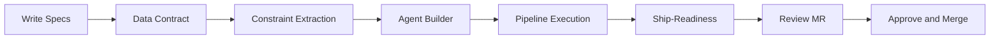
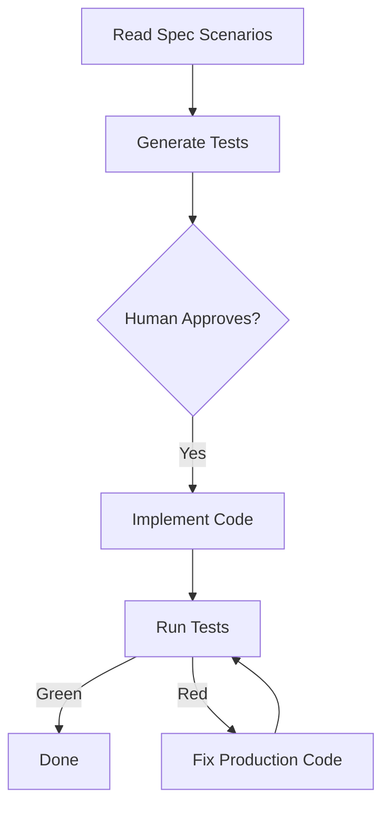

# I Stopped Writing Code. My AI Agents Ship 3 Projects in Parallel.


> What I learned building real systems with an Autonomous Code Factory powered by Kiro.

*Disclaimer: The ideas, analyses, and conclusions presented here reflect my personal views as a technology professional and must not be interpreted as official statements from any employer, current or former.*


---

## The Shift

Six months ago, I spent my days writing code, reviewing diffs, and context-switching between three projects. I was the bottleneck. Every pull request waited for my eyes. Every bug waited for my hands.

Today, I write specifications. AI agents write the code, generate the tests, validate the pipeline, and open merge requests. I review outcomes, not diffs. Three projects run in parallel. The agents work while I architect the next milestone.

This is not a future vision. This is my operating model today, built on [Amazon Kiro](https://kiro.dev) and an open-source pattern called the **Forward Deployed Engineer**.

## What Is a Forward Deployed Engineer?

A Forward Deployed Engineer (FDE) is an AI agent deployed into a specific project's context. It knows your pipeline architecture, your quality standards, your module boundaries, and your governance rules. It is not a general-purpose coding assistant.

Think of it this way: a coding assistant answers questions. A Forward Deployed Engineer executes engineering work within your system's constraints.

The difference in quality is measurable. Same task, same AI model:

```
Without FDE protocol:  33% quality score
With FDE protocol:    100% quality score
Improvement:          +67 percentage points
```

## The Five Planes

The factory is organized into five modular planes. Each plane owns a specific responsibility and communicates with others through well-defined interfaces.

| Plane | Responsibility | Key Components |
|-------|---------------|----------------|
| **1. Version Source Management** | Where code lives, how it flows | Project Isolation, ALM Platforms, PR Delivery |
| **2. FDE (Agent Pipeline)** | How agents are provisioned and run | Autonomy Resolution, Agent Builder, Pipeline Execution |
| **3. Context** | Knowledge that feeds the agents | Constraint Extractor, Prompt Registry, Scope Boundaries |
| **4. Data** | Structured data flow through the factory | Router, Task Queue, Artifact Storage, EventBridge |
| **5. Control** | Governance, observability, safety | SDLC Gates, DORA Metrics, Pipeline Safety, Failure Modes |

> See the [full plane diagrams and narratives](https://github.com/truerocha/forward-deployed-engineer-pattern/tree/main/docs/architecture/planes) for component-level detail.

## How the Factory Works

The factory operates on four design principles:

**Every component has rigid inputs and outputs.** A workspace receives a specification and produces a merge request. No ambiguity in between.

**Context transmission is clean and minimal.** The agent receives only what it needs for the current task — not everything the project has ever produced.

**Successful patterns strengthen over time.** The factory accumulates knowledge across sessions. Patterns that work get promoted. Patterns that do not get archived.

**The human decides WHAT. The agent decides HOW.** If I am deciding how to implement something, the factory is operating below its target level. If the agent is deciding what to build, the factory has lost control.

Here is the daily rhythm:



## The Data Contract

Every task enters the factory through a **data contract** — a canonical schema that all components consume. The contract carries:

- **Required fields**: title, description, type, priority, level, acceptance criteria, tech stack
- **Optional fields**: constraints, related docs, target environment, dependencies
- **Agent-populated fields**: task ID, status, prompt version, completion report

The Router extracts this contract from platform-specific payloads (GitHub issue forms, GitLab scoped labels, Asana custom fields). Every downstream component reads from the same contract. No ambiguity, no guessing.

> See [ADR-010: Data Contract for Task Input](https://github.com/truerocha/forward-deployed-engineer-pattern/blob/main/docs/adr/ADR-010-data-contract-task-input.md).

## Autonomy Levels

Not every task needs the same level of supervision. The factory computes an **autonomy level** (L2 through L5) from the data contract and adapts its pipeline accordingly:

| Level | Name | Human Checkpoints | Use Case |
|-------|------|-------------------|----------|
| L5 | Observer | None | Bugfixes, documentation |
| L4 | Approver | PR review only | Standard features |
| L3 | Consultant | After recon + PR review | Architectural features |
| L2 | Collaborator | Every phase + PR review | High-uncertainty tasks |

Higher autonomy means fewer gates and faster execution. Lower autonomy means more human checkpoints. The inner loop gates (lint, test, build) always run regardless of level — they are non-negotiable safety.

> See [ADR-013: Enterprise-Grade Autonomy](https://github.com/truerocha/forward-deployed-engineer-pattern/blob/main/docs/adr/ADR-013-enterprise-grade-autonomy-and-observability.md).

## Constraint Extraction

Before any agent starts, the factory extracts **machine-validatable constraints** from the task's related documents and constraints field:

- **Rule-based pass** (default): regex patterns catch version pins (Python 3.11), latency thresholds (p99 < 200ms), auth mandates (must use OAuth2), encryption requirements (AES-256), and dependency exclusions. Zero cost, sub-millisecond.
- **LLM-based pass** (opt-in): for nuanced prose constraints that regex cannot capture. Adds ~2-5s latency.

The DoR Gate validates extracted constraints against the tech stack. If a constraint conflicts with the declared stack, the pipeline blocks before any code is written.

## The Agent Builder

The Agent Builder provisions **specialized agents** for each task using three inputs:

1. **tech_stack** → queries the Prompt Registry for context-matched prompts
2. **type** → determines which pipeline phases to run (bugfixes skip reconnaissance)
3. **constraints** → injected as a structured block into the agent's system prompt

If the Prompt Registry has no match, the builder falls back to base prompts. Every agent is scoped to a single task ID — zero cross-project interference.

## SDLC Gates: Inner Loop and Outer Loop

The factory enforces a complete Software Development Lifecycle through two loops:

**Inner Loop** (per-commit, fast feedback):
```
lint → typecheck → unit-test → build
```
Commands are resolved automatically from the tech stack. Max 3 retries per gate.

**Outer Loop** (per-task, quality gates):
```
DoR Gate → Constraint Extraction → Adversarial Challenge → Ship-Readiness
```
If any outer gate does not pass, the pipeline blocks. Ship-Readiness validates that all inner and outer gates passed before the PR opens.

## DORA Metrics

The factory measures itself using the four DORA metrics plus five factory-specific metrics:

| Metric | What It Measures |
|--------|-----------------|
| Lead Time | InProgress → PR opened |
| Deployment Frequency | Tasks completed per time window |
| Change Failure Rate | Tasks that did not complete / total attempted |
| MTTR | Time from error → next successful completion |
| Constraint Extraction Time | How long extraction took |
| DoR Gate Pass Rate | % of tasks that pass DoR on first attempt |
| Inner Loop Retry Rate | Average retries per gate |
| Agent Specialization Hit Rate | % of tasks that got a Registry prompt |
| Domain Breakdown | Acceptance rate segmented by tech stack |

The Factory Health Report computes a DORA performance level (Elite / High / Medium / Low) and persists it to S3 for dashboard consumption.

## Pipeline Safety

Two mechanisms protect the codebase:

**PR Diff Review Gate**: scans the aggregate changeset for secrets (AWS keys, GitHub tokens, private keys), debug code (console.log, breakpoints, pdb imports), sensitive files (.env, .pem), and excessively large changes. Secrets are hard rejections.

**Automatic Rollback**: before the agent starts, a checkpoint captures the current HEAD SHA. If the Circuit Breaker exhausts 3 retries, the branch resets to the checkpoint. Local reset only — no force push. The workspace is clean for the next attempt.

## Failure Mode Taxonomy

When a task does not complete, the factory classifies **why** using detectable signals:

| Code | Category | Recovery |
|------|----------|----------|
| FM-01 | Spec ambiguity | Request clarification |
| FM-03 | Tool not responding | Retry with backoff |
| FM-05 | Complexity exceeded | Decompose into subtasks |
| FM-06 | Test regression | Rollback and retry |
| FM-08 | Timeout | Rollback and report |
| FM-99 | Unknown | Log full context for review |

This enables learning from patterns. After 100 tasks, the taxonomy is reviewed against real data.

## Scope Boundaries

The factory has explicit limits. It rejects tasks it cannot handle with measurable confidence:

**In scope**: features with acceptance criteria, bugfixes with clear reproduction, documentation, infrastructure with defined outcomes.

**Out of scope**: production deployments, PR merges, issue closures, tasks without acceptance criteria, tasks without tech stack.

Every accepted task receives a **confidence level** (high / medium / low) based on available signals: tooling support, criteria specificity, constraints presence, and related docs availability.

> See [docs/design/scope-boundaries.md](https://github.com/truerocha/forward-deployed-engineer-pattern/blob/main/docs/design/scope-boundaries.md).

## Project Isolation

The factory operates like a SaaS kernel. Each task runs in a completely isolated namespace:

- **Process**: each event spawns a new ECS Fargate task
- **Filesystem**: `/tmp/workspace/{task_id}`
- **Storage**: `s3://{bucket}/projects/{task_id}/`
- **Git**: branch `fde/{task_id}/{sanitized-title}`
- **Memory**: transient agent definitions scoped to task ID
- **Tracing**: unique correlation ID per task

Zero cross-project interference. Multiple tasks run in parallel without neighborhood noise.

## The Halting Condition

The most important design decision: **tests are the halting condition**.

The agent generates tests from my specification scenarios before writing any production code. I approve the tests — not the implementation. Once approved, the tests are immutable. The agent cannot modify them to make the build pass.

The agent has one objective: make the approved tests pass while satisfying all constraints.



## Research Foundations

The pattern draws from peer-reviewed studies:

- **Code reading is the dominant bottleneck** (Zhang et al., SWE-AGI, 2026) — our Reconnaissance Agent reads the codebase before writing. The Agent Builder provisions specialized agents that know the tech stack.
- **Agent scaffolding matters as much as model capability** (Wong et al., 2026) — a weaker model with strong scaffolding outperformed a stronger model with weak scaffolding on SWE-Bench-Pro.
- **Two stable collaboration patterns emerge in production** (Mao et al., WhatsCode, 2025) — one-click rollout (60%) and commandeer-revise (40%). Our autonomy levels (L4-L5 and L2-L3) map to these patterns.
- **Autonomy is a deliberate design decision** (Feng et al., Levels of Autonomy, 2025) — separate from capability. Our `autonomy_level` field in the data contract implements this principle.
- **Stable error patterns enable systematic improvement** (Deng et al., SWE-Bench Pro, 2025) — our FM-01 through FM-99 taxonomy classifies why tasks do not complete.

## Getting Started

The factory template is open source. Setup takes 15 minutes:

```bash
git clone https://github.com/truerocha/forward-deployed-engineer-pattern.git ~/factory-template
cd ~/factory-template
bash scripts/pre-flight-fde.sh
bash scripts/validate-deploy-fde.sh
bash scripts/code-factory-setup.sh
```

The [adoption guide](https://github.com/truerocha/forward-deployed-engineer-pattern/blob/main/docs/guides/fde-adoption-guide.md) includes walkthroughs for Next.js applications and Python microservices, a detailed daily operating rhythm, and troubleshooting scenarios.

## The Code Is the Output. The Specification Is the Product.

The factory does not replace engineering judgment. I write the specifications that define what the system does. I approve the outcomes that determine what ships. I provide feedback that improves the factory over time.

What changed is where I spend my time. I moved from writing implementation code to writing specifications and approving outcomes. The agents handle the rest.

The specification is the product. The code is the output.


---

**Repository**: [github.com/truerocha/forward-deployed-engineer-pattern](https://github.com/truerocha/forward-deployed-engineer-pattern)

**Documentation**: [Architecture Planes](https://github.com/truerocha/forward-deployed-engineer-pattern/tree/main/docs/architecture/planes) | [Flows](https://github.com/truerocha/forward-deployed-engineer-pattern/blob/main/docs/flows/README.md) | [ADRs](https://github.com/truerocha/forward-deployed-engineer-pattern/tree/main/docs/adr) | [Scope Boundaries](https://github.com/truerocha/forward-deployed-engineer-pattern/blob/main/docs/design/scope-boundaries.md) | [Adoption Guide](https://github.com/truerocha/forward-deployed-engineer-pattern/blob/main/docs/guides/fde-adoption-guide.md)
