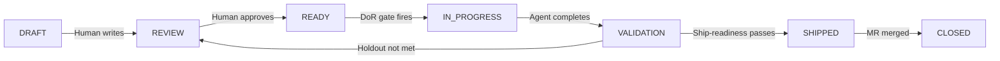

# Spec Lifecycle Flow

```mermaid
flowchart LR
    DRAFT[DRAFT] -->|Human writes| REVIEW[REVIEW]
    REVIEW -->|Human approves| READY[READY]
    READY -->|DoR gate fires| PROGRESS[IN_PROGRESS]
    PROGRESS -->|Agent completes| VALIDATION[VALIDATION]
    VALIDATION -->|Ship-readiness passes| SHIPPED[SHIPPED]
    VALIDATION -->|Holdout not met| REVIEW
    SHIPPED -->|MR merged| CLOSED[CLOSED]
```

## Related
- Hook: [`fde-dor-gate`](../../.kiro/hooks/fde-dor-gate.kiro.hook)
- ADR: [ADR-002 Spec as Control Plane](../adr/ADR-002-spec-as-control-plane.md)
