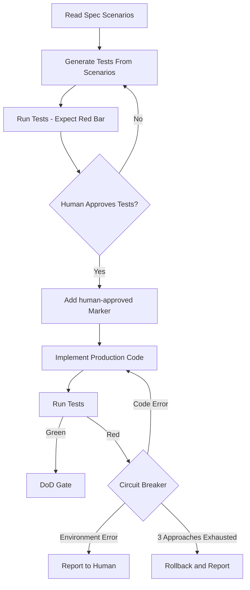

# Agentic TDD Flow

## Related
- Hooks: [`fde-test-immutability`](../../.kiro/hooks/fde-test-immutability.kiro.hook), [`fde-circuit-breaker`](../../.kiro/hooks/fde-circuit-breaker.kiro.hook)
- ADR: [ADR-003 Agentic TDD](../adr/ADR-003-agentic-tdd-halting-condition.md)
