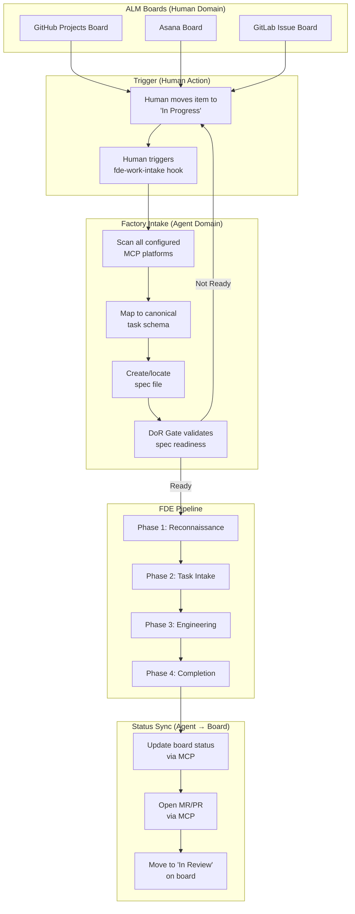
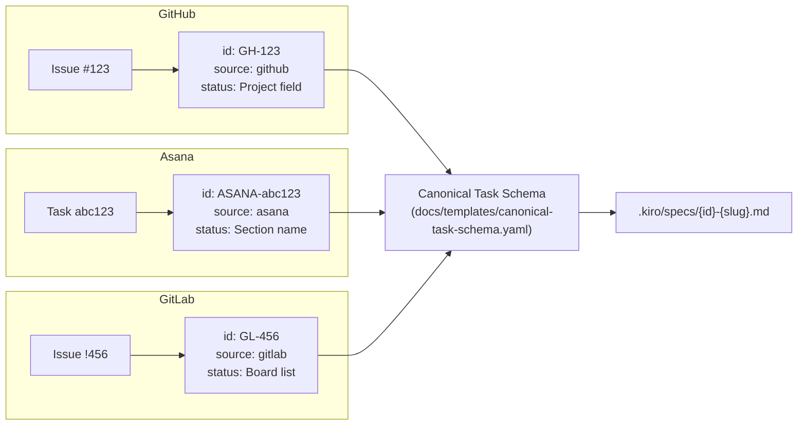

# Multi-Platform Work Intake Flow

How work enters the factory from GitHub Projects, Asana, and GitLab Ultimate boards.



## Platform Adapter Mapping



## API Validation Pre-Flight

Before enabling the work intake hook, validate API access:

```bash
# Validate all platforms
bash scripts/validate-alm-api.sh --all

# Validate individual platforms
bash scripts/validate-alm-api.sh --github
bash scripts/validate-alm-api.sh --asana
bash scripts/validate-alm-api.sh --gitlab
```

## Environment Variables

| Variable | Platform | Required Scopes |
|----------|----------|----------------|
| `GITHUB_TOKEN` | GitHub | `repo`, `project` |
| `ASANA_ACCESS_TOKEN` | Asana | Full access PAT |
| `GITLAB_TOKEN` | GitLab | `api` scope |
| `GITLAB_URL` | GitLab | N/A (default: gitlab.com) |
| `GITLAB_PROJECT_ID` | GitLab | N/A (project ID for board access) |

## Related
- Hook: [`fde-work-intake`](../../.kiro/hooks/fde-work-intake.kiro.hook)
- Hook: [`fde-enterprise-backlog`](../../.kiro/hooks/fde-enterprise-backlog.kiro.hook)
- ADR: [ADR-008 Multi-Platform Project Tooling](../adr/ADR-008-multi-platform-project-tooling.md)
- Schema: [Canonical Task Schema](../templates/canonical-task-schema.yaml)
- Templates: [GitHub](../templates/task-template-github.md) | [Asana](../templates/task-template-asana.md) | [GitLab](../templates/task-template-gitlab.md)
