# Staff Engineer Onboarding Flow

The complete E2E flow from clone to first spec execution.

```mermaid
flowchart TD
    subgraph PreFlight["Step 1: pre-flight-fde.sh"]
        CLONE["Staff Engineer clones\nfactory-template repo"] --> README["Reads README.md"]
        README --> RUN_PF["Runs pre-flight-fde.sh"]

        RUN_PF --> TOOLS["Section 1: Core Tools\ngit, node, python3, docker,\naws-cli, terraform, uvx, curl"]
        TOOLS --> CREDS["Section 2: Credentials\nGITHUB_TOKEN, ASANA_ACCESS_TOKEN,\nGITLAB_TOKEN, AWS (sts get-caller-identity)"]
        CREDS --> IAM["Section 3: AWS IAM Validation\nbedrock:InvokeModel\necs:RunTask, ecr:PushImage\ns3:PutObject, secretsmanager:GetSecretValue"]
        IAM --> KIRO_ENV["Section 4: Kiro Environment\n~/.kiro exists? steerings? MCP?"]
        KIRO_ENV --> CONFIG["Section 5: Interactive Config"]

        CONFIG --> MODE{"Project Mode?"}
        MODE -->|"experiment"| EXP["Local-only\nNo remote repo\nNo cloud\nGit init only"]
        MODE -->|"greenfield"| GF["New project\nCreate repo via MCP\nFull cloud optional"]
        MODE -->|"brownfield"| BF["Existing codebase\nClone repo\nScan conventions"]

        EXP --> CLOUD_Q{"Deploy to AWS?"}
        GF --> CLOUD_Q
        BF --> CLOUD_Q
        CLOUD_Q -->|"no"| LOCAL["Local-only manifest"]
        CLOUD_Q -->|"yes"| AWS_CFG["Collect AWS config:\nregion, env, Bedrock model,\nAgentCore, ECS service"]
        LOCAL --> MANIFEST["Write ~/.kiro/fde-manifest.json"]
        AWS_CFG --> MANIFEST
    end

    subgraph ValidateDeploy["Step 2: validate-deploy-fde.sh"]
        MANIFEST --> LOAD["Load manifest"]
        LOAD --> CP["Control Plane\nHooks, steerings,\nglobal laws, templates"]
        CP --> DP["Data Plane\nALM APIs live check\nRepo accessibility"]
        DP --> FP["FDE Plane\nMCP config, hook JSON,\nproject paths writable"]
        FP --> CLOUD_P{"Cloud requested?"}
        CLOUD_P -->|"no"| SKIP_CL["Skip cloud validation"]
        CLOUD_P -->|"yes"| CLP["Cloud Plane\nAWS auth, IAM perms,\nTerraform IaC, Docker,\nBedrock model access,\nECR/ECS state"]
        SKIP_CL --> REPORT["Write deploy report"]
        CLP --> REPORT
    end

    subgraph FactorySetup["Step 3: code-factory-setup.sh"]
        REPORT --> GLOBAL["Step 1: Global Infrastructure\nsteerings, MCP, notes,\nfactory state"]
        GLOBAL --> PROJECTS["Step 2: Per-Project Setup"]

        PROJECTS --> PROJ_MODE{"Project mode?"}
        PROJ_MODE -->|"experiment"| EXP_SETUP["git init\nCreate requirements.md\nNo remote"]
        PROJ_MODE -->|"greenfield"| GF_SETUP["Clone/init repo\nCreate requirements.md\nAgent reads to scaffold"]
        PROJ_MODE -->|"brownfield"| BF_SETUP["Clone repo\nScan conventions\n(languages, tests, CI,\nlinters, Docker)"]

        EXP_SETUP --> PROVISION["Provision workspace\nhooks, steerings, MCP,\ntask templates"]
        GF_SETUP --> PROVISION
        BF_SETUP --> PROVISION

        PROVISION --> HOOKS["Enable hooks by level\nL2/L3/L4"]
        HOOKS --> CLOUD_D{"Cloud requested?"}
        CLOUD_D -->|"no"| STATE["Step 4: Factory State"]
        CLOUD_D -->|"yes"| TF["Step 3: AWS Deploy\n3a: Generate tfvars\n3b: terraform plan\n3c: Human confirms → apply\n3d: Docker build → ECR push\n3e: Secrets Manager"]
        TF --> STATE
    end

    subgraph StaffEngineer["Staff Engineer Starts Working"]
        STATE --> OPEN["Open project in Kiro IDE"]
        OPEN --> WRITE_SPEC["Write spec or\nedit requirements.md"]
        WRITE_SPEC --> FDE["#fde Execute the spec"]
        FDE --> PIPELINE["FDE 4-Phase Protocol\nRecon → Intake → Engineering → Completion"]
        PIPELINE --> REVIEW["Review MR / completion report"]
        REVIEW --> MERGE["Approve and merge"]
    end
```

## Project Modes

| Mode | Remote Repo | Cloud Deploy | Use Case |
|------|------------|-------------|----------|
| **experiment** | No (local git only) | No | Quick prototyping, learning the factory, POCs |
| **greenfield** | Yes (create new) | Optional | New projects, agent scaffolds from requirements.md |
| **brownfield** | Yes (clone existing) | Optional | Existing codebases, agent reads conventions first |

## IAM Permissions Required for AWS Deployment

The pre-flight script validates these specific permissions:

| Service | Actions | Why |
|---------|---------|-----|
| **Bedrock** | `bedrock:InvokeModel`, `bedrock:InvokeModelWithResponseStream` | Agent inference |
| **ECR** | `ecr:GetAuthorizationToken`, `ecr:BatchCheckLayerAvailability`, `ecr:PutImage` | Push Strands agent image |
| **ECS** | `ecs:RunTask`, `ecs:DescribeTasks`, `ecs:RegisterTaskDefinition` | Run headless agents |
| **S3** | `s3:PutObject`, `s3:GetObject`, `s3:ListBucket` | Factory artifacts |
| **Secrets Manager** | `secretsmanager:PutSecretValue`, `secretsmanager:GetSecretValue` | ALM tokens |
| **CloudWatch** | `logs:CreateLogGroup`, `logs:CreateLogStream`, `logs:PutLogEvents` | Agent logs |
| **IAM** | `iam:CreateRole`, `iam:AttachRolePolicy` (for Terraform) | Provision roles |
| **VPC** | `ec2:CreateVpc`, `ec2:CreateSubnet`, `ec2:CreateSecurityGroup` | Network for ECS |

## Related
- Script: [`pre-flight-fde.sh`](../../scripts/pre-flight-fde.sh)
- Script: [`validate-deploy-fde.sh`](../../scripts/validate-deploy-fde.sh)
- Script: [`code-factory-setup.sh`](../../scripts/code-factory-setup.sh)
- Terraform: [`infra/terraform/`](../../infra/terraform/)
- Docker: [`infra/docker/`](../../infra/docker/)
- ADR: [ADR-008 Multi-Platform Project Tooling](../adr/ADR-008-multi-platform-project-tooling.md)
