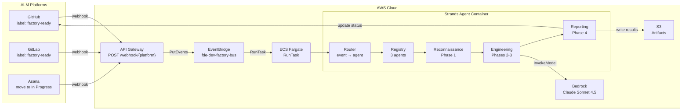

# Cloud Orchestration Flow

How ALM webhooks trigger headless agent execution on AWS.



## Webhook URLs

After `terraform apply`, the outputs provide webhook URLs:

| Platform | URL Pattern | Configure At |
|----------|------------|-------------|
| GitHub | `https://{api-id}.execute-api.{region}.amazonaws.com/webhook/github` | Repo → Settings → Webhooks |
| GitLab | `https://{api-id}.execute-api.{region}.amazonaws.com/webhook/gitlab` | Project → Settings → Webhooks |
| Asana | `https://{api-id}.execute-api.{region}.amazonaws.com/webhook/asana` | Asana API → Create Webhook |

## Agent Pipeline

| Agent | Phase | Tools | Purpose |
|-------|-------|-------|---------|
| Reconnaissance | 1 | read_spec, run_shell_command | Maps modules, produces intake contract |
| Engineering | 2-3 | read_spec, write_artifact, run_shell_command, ALM tools | Executes engineering recipe |
| Reporting | 4 | write_artifact, ALM tools | Writes completion report, updates ALM |

## E2E Validation

```bash
bash scripts/validate-e2e-cloud.sh --profile profile-name
```

## Teardown

```bash
bash scripts/teardown-fde.sh --terraform
bash scripts/teardown-fde.sh --tags
bash scripts/teardown-fde.sh --dry-run
```

## Related
- ADR: [ADR-009 AWS Cloud Infrastructure](../adr/ADR-009-aws-cloud-infrastructure.md)
- Flow: [12-Staff Engineer Onboarding](12-staff-engineer-onboarding.md)
- Terraform: `infra/terraform/eventbridge.tf`, `infra/terraform/apigateway.tf`
- Agent code: `infra/docker/agents/`
