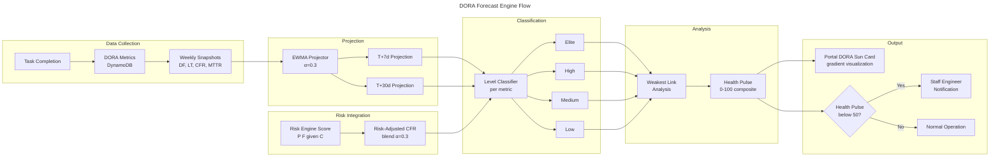

# Flow 17: DORA Forecast Engine

> Forward-looking DORA metric projections — detects trajectory degradation before it impacts delivery.

## Trigger

- **Task Completion**: After any task outcome is recorded
- **Weekly Snapshot**: Scheduled DynamoDB write of aggregated metrics
- **Feature Flag**: `DORA_FORECAST_ENABLED`

## Flow



## EWMA Parameters

| Parameter | Value | Rationale |
|-----------|-------|-----------|
| α (smoothing factor) | 0.3 | Balances responsiveness with stability |
| Minimum snapshots | 3 | Below this, fallback to current-week classification |
| Projection horizons | T+7d, T+30d | Short-term tactical + medium-term strategic |

## Health Pulse Calculation

```
health_pulse = Σ(metric_score_i × weight_i) × 100

metric_score: Elite=1.0, High=0.75, Medium=0.5, Low=0.25
weights: DF=0.25, LT=0.25, CFR=0.30, MTTR=0.20
```

## Risk-Adjusted CFR

```
risk_adjusted_cfr = 0.7 × historical_cfr + 0.3 × avg_risk_score
```

Blends historical failure rate with the Risk Engine's predictive scores to produce a forward-looking CFR estimate.

## Related

- [ADR-023](../adr/ADR-023-dora-forecast-engine.md) — Architecture decision
- [Design Doc](../design/pec-intelligence-layer.md) — PEC Intelligence Layer
- [Flow 16](16-risk-inference.md) — Risk Inference (produces risk scores consumed here)
- [Flow 19](19-persona-portal.md) — Persona Portal (renders DORA Sun card)
