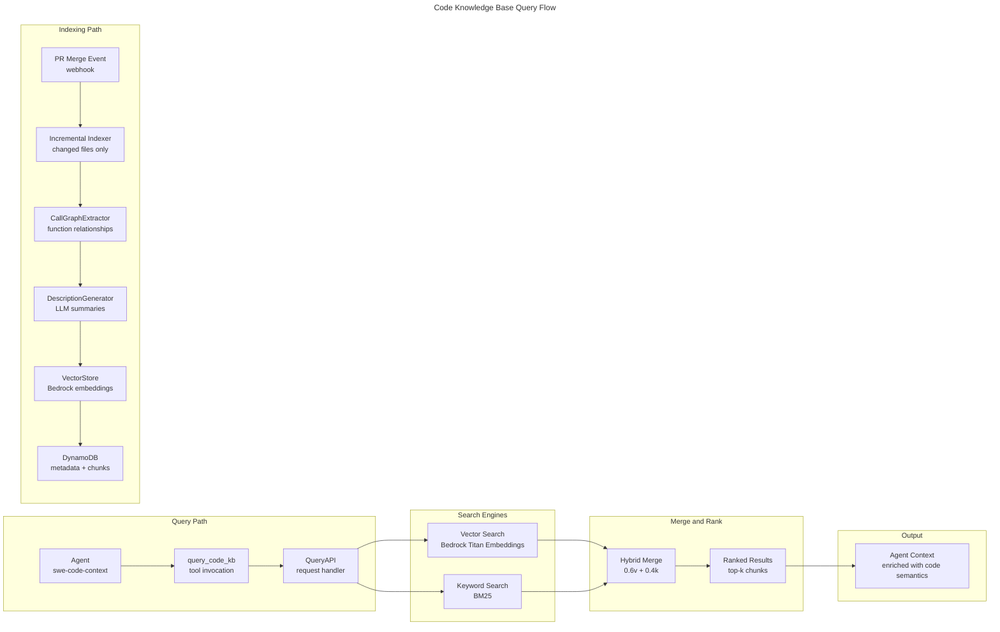

# Flow 18: Code Knowledge Base Query

> Semantic code navigation for agents — hybrid vector + keyword search replaces blind file reading.

## Trigger

- **Agent Reconnaissance**: `swe-code-context` agent invokes `query_code_kb` tool during task planning
- **Indexing**: PR merge event triggers incremental indexer
- **Feature Flag**: `CODE_KB_ENABLED`

## Flow

## Hybrid Search Weights

| Engine | Weight | Rationale |
|--------|--------|-----------|
| Vector (semantic) | 0.6 | Captures intent and conceptual similarity |
| Keyword (BM25) | 0.4 | Handles exact identifiers, function names, imports |

## Indexing Pipeline

| Stage | Input | Output |
|-------|-------|--------|
| Incremental Indexer | Changed file paths from PR diff | File chunks (512 tokens, 64 overlap) |
| CallGraphExtractor | AST parse of source files | Function-to-function call edges |
| DescriptionGenerator | Code chunks | Natural language descriptions (via LLM) |
| VectorStore | Descriptions + code | Bedrock Titan Embeddings (1024-dim) |
| DynamoDB | All metadata | Chunk ID, file path, line range, embedding ref |

## Query Parameters

| Parameter | Default | Description |
|-----------|---------|-------------|
| `query` | — | Natural language or code snippet |
| `top_k` | 10 | Maximum results returned |
| `file_filter` | `None` | Restrict to specific paths/patterns |
| `include_call_graph` | `false` | Include related functions via call graph |

## Related

- [Design Doc](../design/pec-intelligence-layer.md) — PEC Intelligence Layer
- [Flow 16](16-risk-inference.md) — Risk Inference (agents use KB during risk context gathering)
- [ADR-015](../adr/ADR-015-repo-onboarding-phase-zero.md) — Repo Onboarding (initial full index)
