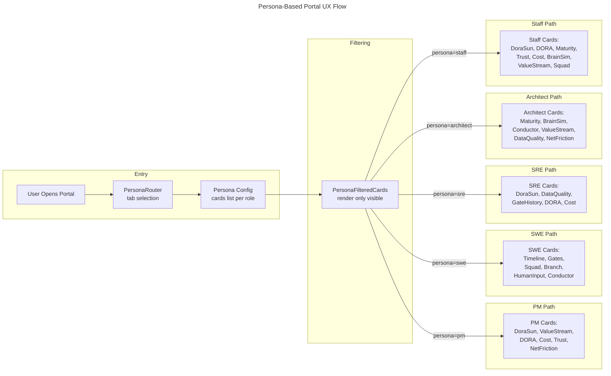

# Flow 19: Persona-Based Portal UX

> Role-filtered observability — each persona sees only the cards relevant to their decision-making context.

## Trigger

- **User Action**: Opens portal or switches persona tab
- **Feature Flag**: `PERSONA_PORTAL_ENABLED`

## Flow

## Persona Card Assignments

| Persona | Cards | Focus |
|---------|-------|-------|
| PM | DoraSun, ValueStream, DORA, Cost, Trust, NetFriction | Business outcomes and delivery health |
| SWE | Timeline, Gates, Squad, Branch, HumanInput, Conductor | Execution details and agent coordination |
| SRE | DoraSun, DataQuality, GateHistory, DORA, Cost | Reliability metrics and operational health |
| Architect | Maturity, BrainSim, Conductor, ValueStream, DataQuality, NetFriction | System design and capability evolution |
| Staff | DoraSun, DORA, Maturity, Trust, Cost, BrainSim, ValueStream, Squad | Full oversight with strategic focus |

## Component Architecture

| Component | Responsibility |
|-----------|---------------|
| `PersonaRouter` | Reads active tab, resolves persona type |
| `PersonaConfig` | Static mapping of persona to card IDs |
| `PersonaFilteredCards` | Filters card array, renders only matching cards |
| `DoraSunCard` | Visualizes Health Pulse as radial gradient (green/yellow/red) |

## Design Principles

1. **Additive, not restrictive** — Staff sees the superset; other personas see curated subsets
2. **Zero-config** — Persona selection is a tab click, no settings page
3. **Card independence** — Each card fetches its own data; filtering is purely render-level
4. **Progressive disclosure** — Cards expand on click for detail; collapsed view shows headline metric

## Related

- [ADR-017](../adr/ADR-017-react-portal-observability-ux.md) — React Portal architecture
- [Design Doc](../design/pec-intelligence-layer.md) — PEC Intelligence Layer
- [Flow 17](17-dora-forecast.md) — DORA Forecast (produces Health Pulse for DoraSun card)
